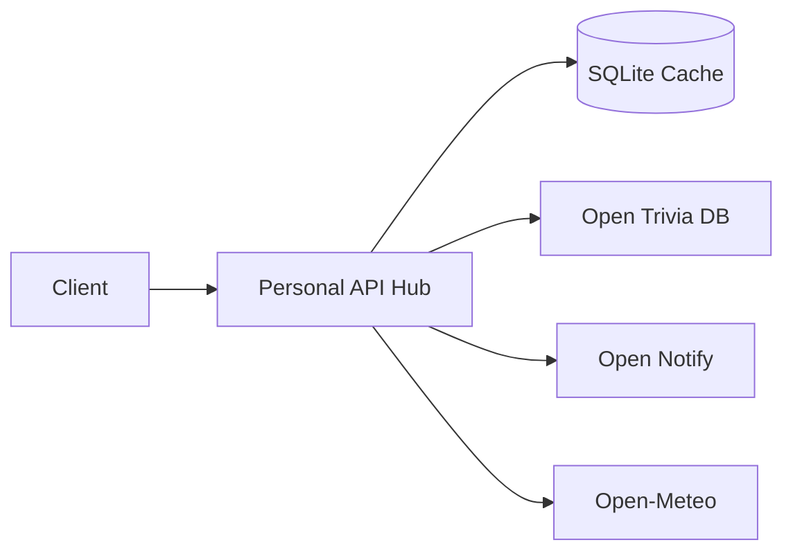

# Personal API Hub

> **Fetch · Cache · Analyze** — A personal data hub that pulls trivia, ISS location, and weather from public APIs, caches everything in SQLite, and serves custom analytics endpoints.


**Jump to:** [Quick Start](#quick-start) · [API Reference](#api-reference) · [Bruno Collection](#bruno-collection) · [Troubleshooting](#troubleshooting)

---

## Overview

Personal API Hub is a **FastAPI + SQLite** service that acts as your own mini data platform:

| Layer | What it does |
|-------|--------------|
| **Fetch** | Calls Open Trivia DB, Open Notify (ISS), and Open-Meteo |
| **Cache** | Stores responses locally with per-source TTL |
| **Serve** | REST endpoints for fresh or cached data |
| **Analyze** | Cross-source stats, ISS distance, weather trends |

No API keys required. All upstream services are free and public.



---

## Quick Start

### Prerequisites

| Requirement | Notes |
|-------------|-------|
| Python 3.9+ | Check with `python3 --version` |
| pip | Bundled with Python |
| Internet | Required for live API calls |
| Git | To clone the repo |

### 1. Clone and install

```bash
git clone https://github.com/deepak-cl/blog-app.git
cd blog-app
git checkout cursor/personal-api-data-hub-0354

python3 -m venv .venv
source .venv/bin/activate          # Windows: .venv\Scripts\activate
pip install -r requirements.txt
```

### 2. Run the server

```bash
uvicorn app.main:app --reload --host 0.0.0.0 --port 8000
```

### 3. Verify

| Link | Purpose |
|------|---------|
| http://localhost:8000/ | Service index |
| http://localhost:8000/health | Health + cache stats |
| http://localhost:8000/docs | Interactive Swagger UI |

```bash
curl http://localhost:8000/health
```

### 4. Populate the cache

Analytics need cached data first. Refresh all three sources:

```bash
curl -X POST http://localhost:8000/trivia/refresh
curl -X POST http://localhost:8000/iss/refresh
curl -X POST http://localhost:8000/weather/refresh
curl http://localhost:8000/analytics/summary
```

---

## Data Sources

| Source | Upstream | Cache TTL | Default |
|--------|----------|-----------|---------|
| Trivia | [Open Trivia DB](https://opentdb.com/) | 1 hour | 10 multiple-choice questions |
| ISS | [Open Notify](http://open-notify.org/Open-Notify-API/ISS-Location-Now/) | 5 min | Live lat/lng |
| Weather | [Open-Meteo](https://open-meteo.com/) | 30 min | New York City forecast |

The SQLite database is created automatically at `data/hub.db` on first run.

---

## How Caching Works

```
GET  /{source}              -> cached if fresh, else fetch + store
GET  /{source}?refresh=true -> always fetch + store
POST /{source}/refresh      -> always fetch + store
GET  /{source}/cached       -> cache only (404 if empty)
```

TTL values live in `app/config.py` and appear in `GET /health`.

---

## API Reference

### Health

| Method | Endpoint | Description |
|--------|----------|-------------|
| `GET` | `/` | Service name and endpoint index |
| `GET` | `/health` | Status, DB connectivity, cache stats |

### Data Sources

Each of `/trivia`, `/iss`, and `/weather` supports the caching pattern above.

### Analytics

| Method | Endpoint | Description |
|--------|----------|-------------|
| `GET` | `/analytics/summary` | Cross-source cache stats |
| `GET` | `/analytics/trivia` | Difficulty and category breakdown |
| `GET` | `/analytics/iss` | Position history + distance traveled (km) |
| `GET` | `/analytics/weather` | 7-day trends, warmest/coldest/wettest days |

Full schemas: http://localhost:8000/docs

---

## Bruno Collection

A ready-made [Bruno](https://www.usebruno.com/) collection ships with this repo:

```
bruno/Personal API Hub/
```

**Setup**

1. Install [Bruno](https://www.usebruno.com/downloads)
2. **Open Collection** and select `bruno/Personal API Hub/`
3. Choose the **Local** environment (`baseUrl` = `http://localhost:8000`)
4. Start the server, then run requests

**Suggested order:** Health -> Refresh all sources -> Analytics folder

---

## Testing

```bash
source .venv/bin/activate
PYTHONPATH=. pytest tests/ -v
```

Tests hit live external APIs. All 5 should pass with network access.

---

## Project Structure

```
.
├── app/
│   ├── main.py              # FastAPI entrypoint
│   ├── config.py            # URLs, TTLs, DB path
│   ├── db/                  # SQLite layer
│   ├── routers/             # HTTP routes
│   ├── services/            # Fetch + cache logic
│   └── utils/               # ISS distance (Haversine)
├── bruno/Personal API Hub/  # Bruno .bru collection
├── tests/
├── data/                    # SQLite DB (runtime)
├── requirements.txt
└── README.md
```

---

## Configuration

Edit `app/config.py` to change:

- **Cache TTLs** — `CACHE_TTL` (seconds per source)
- **Upstream URLs** — trivia, ISS, weather endpoints
- **Weather location** — lat/lng in `WEATHER_API_URL` (default: NYC)

---

## Troubleshooting

| Problem | Fix |
|---------|-----|
| `command not found: uvicorn` | Activate `.venv` or re-run `pip install -r requirements.txt` |
| `404` on `/{source}/cached` | Call `POST /{source}/refresh` first |
| Empty analytics | Refresh all three sources, then hit `/analytics/summary` |
| Upstream API errors | Check internet; external services may be down |
| Port 8000 in use | Use `--port 8001` and update Bruno `baseUrl` |

---

## Tech Stack

FastAPI · SQLite · httpx · pytest · Bruno

---

## Rename this repo?

On GitHub go to **Settings -> General -> Repository name** and set it to `personal-api-hub`.
