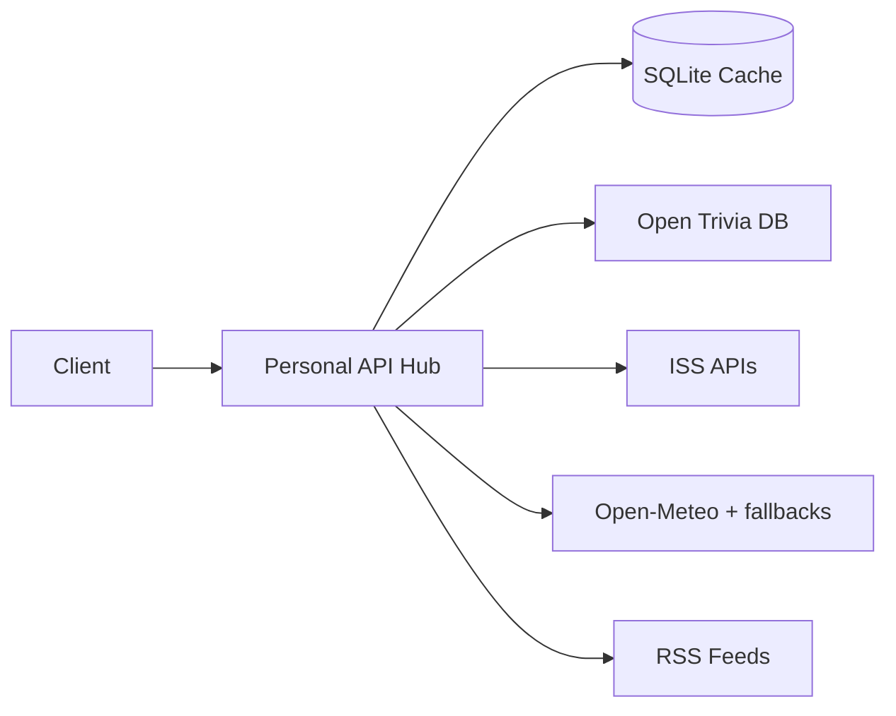

# Personal API Hub

> **Fetch · Cache · Analyze** — A personal data hub that pulls trivia, ISS location, weather, world news, AI developments, and entertainment headlines from public APIs and RSS feeds, caches everything in SQLite, and serves custom analytics endpoints.


**Jump to:** [Quick Start](#quick-start) · [API Reference](#api-reference) · [Geo (India)](#geo-based-weather--iss-india-only) · [Observability](#observability) · [Bruno Collection](#bruno-collection) · [Troubleshooting](#troubleshooting)

---

## Overview

Personal API Hub is a **FastAPI + SQLite** service that acts as your own mini data platform:

| Layer | What it does |
|-------|--------------|
| **Fetch** | Calls Open Trivia DB, ISS trackers, Open-Meteo (and fallbacks), and RSS feeds |
| **Cache** | Stores responses locally with per-source TTL |
| **Serve** | REST endpoints for fresh or cached data |
| **Analyze** | Cross-source stats, ISS distance, weather trends, AI summaries |

Core sources need no API keys. Optional keys improve weather (IMD, OpenWeather) and enable AI briefs.

> **AI / developer lookup:** See [docs/PROJECT.md](docs/PROJECT.md) for architecture, extension guide, and changelog.

Interactive API docs (Swagger): **http://localhost:8000/docs**



---

## Quick Start

### Prerequisites

| Requirement | Notes |
|-------------|-------|
| Python 3.9+ | Check with `python3 --version` |
| pip | Bundled with Python |
| Internet | Required for live API calls |
| Git | To clone the repo |

### 1. Clone and install

```bash
git clone https://github.com/deepak-cl/blog-app.git
cd blog-app
git checkout main

python3 -m venv .venv
source .venv/bin/activate          # Windows: .venv\Scripts\activate
pip install -r requirements.txt
```

### 2. Run the server

```bash
uvicorn app.main:app --reload --host 0.0.0.0 --port 8000
```

### 3. Verify

| Link | Purpose |
|------|---------|
| http://localhost:8000/ | Web dashboard (requests browser location for India weather/ISS) |
| http://localhost:8000/docs | Interactive Swagger UI |
| http://localhost:8000/api | JSON API index |
| http://localhost:8000/health | Health + cache stats (admin) |
| http://localhost:8000/metrics | Prometheus metrics (admin) |

```bash
curl http://localhost:8000/health
curl http://localhost:8000/metrics
```

### 4. Populate the cache

```bash
curl -X POST http://localhost:8000/trivia/refresh
curl -X POST http://localhost:8000/iss/refresh
curl -X POST http://localhost:8000/weather/refresh
curl -X POST http://localhost:8000/news/refresh
curl http://localhost:8000/analytics/summary
```

---

## Data Sources

| Source | Upstream | Cache TTL | Default |
|--------|----------|-----------|---------|
| Trivia | [Open Trivia DB](https://opentdb.com/) | 1 hour | 10 multiple-choice questions |
| ISS | [WhereTheISS.at](https://wheretheiss.at/) / Open Notify | 5 min | Live lat/lng |
| Weather | [Open-Meteo](https://open-meteo.com/) + wttr/IMD/OpenWeather/NWS fallbacks | 2 hours | Anekal, Bengaluru |
| World news | BBC, NPR, Al Jazeera, Guardian RSS | 1 hour | Top headlines |
| AI developments | Hugging Face, OpenAI, Google AI, arXiv, Anthropic RSS | 2 hours | Top headlines |
| Entertainment | BBC, Variety, THR, NPR Arts, Guardian RSS | 1 hour | Industry headlines |

The SQLite database is created automatically at `data/hub.db` on first run.

---

## Geo-based Weather & ISS (India only)

The dashboard requests browser geolocation to personalize weather and ISS distance. Backend endpoints accept optional query params:

```
GET /weather?lat=12.97&lng=77.59
GET /iss?lat=12.97&lng=77.59
GET /analytics/daily-brief?lat=12.97&lng=77.59
POST /analytics/ai-brief?lat=12.97&lng=77.59
```

| Rule | Detail |
|------|--------|
| Bounding box | lat `6.5–35.5`, lng `68–97.5` (approximate India) |
| Both required | `lat` and `lng` must be sent together |
| Outside India | HTTP **403** — `{ "error": "outside_india", "message": "..." }` |
| Geolocation denied | Dashboard falls back to Anekal with a notice |
| Labels | Dynamic — e.g. `Your location (12.97°, 77.59°)` |

---

## How Caching Works

```
GET  /{source}              -> cached if fresh, else fetch + store
GET  /{source}?refresh=true -> always fetch + store
POST /{source}/refresh      -> always fetch + store
GET  /{source}/cached       -> cache only (404 if empty)
```

TTL values live in `app/config.py` and appear in `GET /health`.

---

## API Reference

Full request/response schemas: **http://localhost:8000/docs**

### Root / admin

| Method | Endpoint | Description |
|--------|----------|-------------|
| `GET` | `/` | Web dashboard |
| `GET` | `/api` | JSON service index |
| `GET` | `/docs` | Swagger UI |
| `GET` | `/health` | Status, DB connectivity, cache stats |
| `GET` | `/metrics` | Prometheus text metrics (admin) |

### Data sources

Each source supports the caching pattern above.

| Prefix | Description |
|--------|-------------|
| `/trivia` | Open Trivia DB batch |
| `/iss` | ISS position; optional `?lat=&lng=` for distance reference |
| `/weather` | Forecast; optional `?lat=&lng=` (India only) |
| `/news` | World news RSS headlines |
| `/ai-dev` | AI / ML development RSS headlines |
| `/entertainment` | Entertainment industry RSS headlines |

### Analytics

| Method | Endpoint | Description |
|--------|----------|-------------|
| `GET` | `/analytics/summary` | Cross-source cache stats |
| `GET` | `/analytics/trivia` | Difficulty and category breakdown |
| `GET` | `/analytics/iss` | Position history + distance traveled (km) |
| `GET` | `/analytics/weather` | 7-day trends, warmest/coldest/wettest days |
| `GET` | `/analytics/daily-brief` | Weather + ISS + trivia + headline snapshots; optional `?lat=&lng=` |
| `GET` | `/analytics/news-brief` | Top headlines from news, AI dev, entertainment |
| `GET` | `/analytics/ai-brief/providers` | Configured AI provider list |
| `GET` / `POST` | `/analytics/ai-brief?provider=` | AI-generated summary from cached data; optional `?lat=&lng=` |
| `GET` | `/analytics/cache-efficiency` | Per-source cache age, TTL, hit-friendly status |

### Events (SSE)

| Method | Endpoint | Description |
|--------|----------|-------------|
| `GET` | `/events/stream` | Live SSE feed (health, cache stats, refresh notices) |

---

## Observability

Admin-only endpoints (not linked from the dashboard UI):

### `/metrics` — Prometheus scraping

Returns Prometheus text format with:

- `http_requests_total{method,path,status}` — request counts
- `cache_hits_total{source}` / `cache_misses_total{source}` — cache efficiency
- `cache_last_fetch_timestamp_seconds{source}` — last successful fetch per source
- `cache_ttl_seconds{source}` — configured TTL
- `hub_health_status` — `1` when SQLite is reachable, else `0`

Example scrape config:

```yaml
scrape_configs:
  - job_name: personal-api-hub
    static_configs:
      - targets: ["localhost:8000"]
    metrics_path: /metrics
    scrape_interval: 30s
```

### Grafana (free options)

1. **Grafana Cloud free tier** — Create a stack at [grafana.com](https://grafana.com/), add a Prometheus data source pointing at your public `/metrics` URL (or use Grafana Agent to scrape privately).
2. **Self-hosted** — Run Prometheus + Grafana locally:
   ```bash
   # Prometheus prometheus.yml → scrape localhost:8000/metrics
   docker run -p 9090:9090 prom/prometheus
   docker run -p 3000:3000 grafana/grafana
   ```
   Add Prometheus as a data source in Grafana and build dashboards from `http_requests_total` and cache metrics.

### Render logs

On [Render](https://render.com/), use the service **Logs** tab for stdout/stderr from Uvicorn — no extra setup.

### Uptime monitoring (optional)

[Uptime Kuma](https://github.com/louislam/uptime-kuma) (self-hosted) or any HTTP checker can ping `/health` (JSON) or `/metrics` (text) on an interval.

### Programmatic checks

| Endpoint | Use |
|----------|-----|
| `GET /health` | Liveness + cache population overview |
| `GET /analytics/cache-efficiency` | Detailed per-source stale/TTL status |

---

## Bruno Collection

A ready-made [Bruno](https://www.usebruno.com/) collection ships with this repo:

```
bruno/Personal API Hub/
```

**Setup**

1. Install [Bruno](https://www.usebruno.com/downloads)
2. **Open Collection** and select `bruno/Personal API Hub/`
3. Choose the **Local** environment (`baseUrl` = `http://localhost:8000`)
4. Start the server, then run requests

**Suggested order:** Health → Refresh all sources → Analytics folder

---

## Testing

```bash
source .venv/bin/activate
PYTHONPATH=. pytest tests/ -v
```

Tests include India bounds validation, geo weather/ISS, and metrics. Some tests hit live external APIs.

---

## Deploy on Render (free tier)

1. Push the repo to GitHub and connect it on [Render](https://render.com/)
2. Create a **Web Service** using the included `render.yaml` blueprint, or set manually:
   - **Build command:** `pip install -r requirements.txt`
   - **Start command:** `uvicorn app.main:app --host 0.0.0.0 --port $PORT`
   - **Health check path:** `/health`
3. Visit your service URL — dashboard at `/`, API docs at `/docs`

> **Ephemeral SQLite:** On Render's free tier, the filesystem resets on redeploy. Cached data in `data/hub.db` is lost when the service restarts or redeploys. The background scheduler repopulates cache automatically.

Optional env vars on Render: `IMD_API_KEY`, `OPENWEATHER_API_KEY`, `OPENAI_API_KEY`, `ANTHROPIC_API_KEY`, `GEMINI_API_KEY`.

### Docker

```bash
docker build -t personal-api-hub .
docker run -p 8000:8000 personal-api-hub
```

---

## Project Structure

```
.
├── app/
│   ├── main.py              # FastAPI entrypoint + metrics middleware
│   ├── metrics.py           # Prometheus collector
│   ├── config.py            # URLs, TTLs, RSS feeds, default coords
│   ├── db/                  # SQLite layer
│   ├── routers/             # HTTP routes (incl. /metrics)
│   ├── services/            # Fetch + cache logic
│   └── utils/               # Geo bounds, Haversine, errors
├── static/                  # Web dashboard
├── bruno/Personal API Hub/  # Bruno .bru collection
├── tests/
├── docs/PROJECT.md          # Developer lookup
├── internal/                # Implementation notes
├── data/                    # SQLite DB (runtime)
├── Dockerfile
├── render.yaml
├── requirements.txt
└── README.md
```

---

## Configuration

Edit `app/config.py` to change:

- **Cache TTLs** — `CACHE_TTL` (seconds per source)
- **Default location** — `WEATHER_LATITUDE`, `WEATHER_LONGITUDE` (Anekal, Bengaluru)
- **RSS feeds** — `NEWS_RSS_FEEDS`, `AI_DEV_RSS_FEEDS`, `ENTERTAINMENT_RSS_FEEDS`

---

## Troubleshooting

| Problem | Fix |
|---------|-----|
| `command not found: uvicorn` | Activate `.venv` or re-run `pip install -r requirements.txt` |
| `404` on `/{source}/cached` | Call `POST /{source}/refresh` first |
| Empty analytics | Refresh sources, then hit `/analytics/summary` |
| `403 outside_india` | Use coordinates within India or omit `lat`/`lng` for Anekal default |
| Weather rate limits on Render | Set `IMD_API_KEY` or `OPENWEATHER_API_KEY`; stale cache served when available |
| Upstream API errors | Check internet; external services may be down |
| Port 8000 in use | Use `--port 8001` and update Bruno `baseUrl` |

---

## Tech Stack

FastAPI · SQLite · httpx · feedparser · pytest · Bruno
